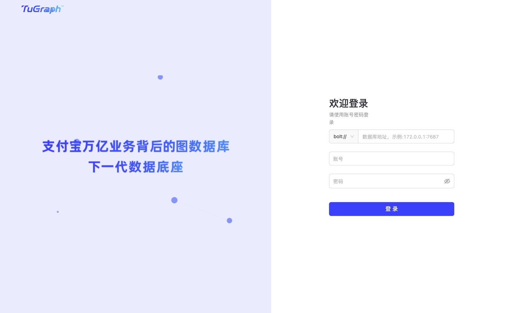
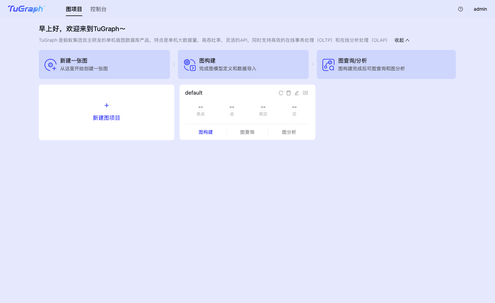
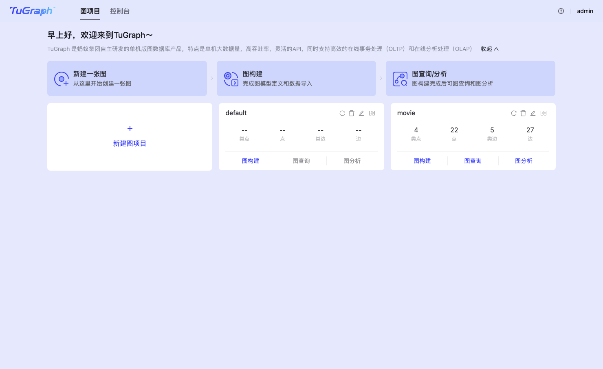
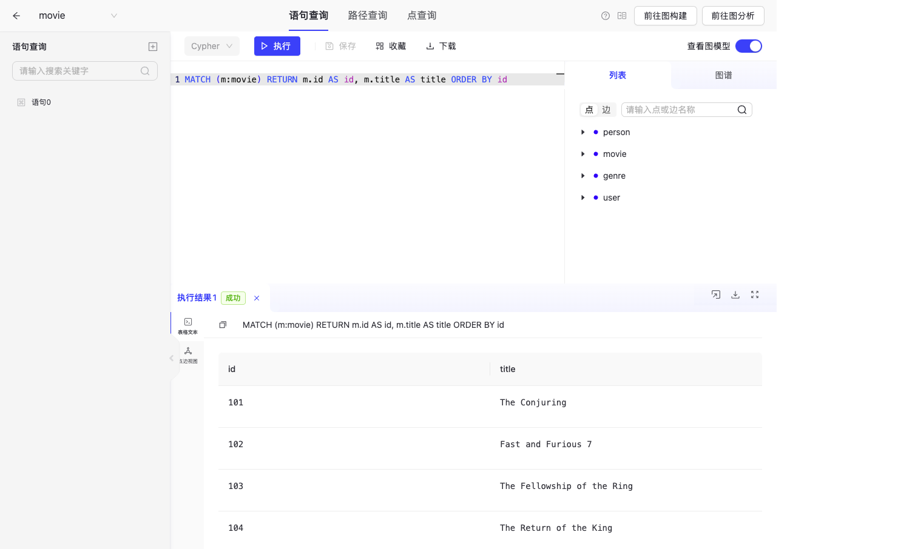
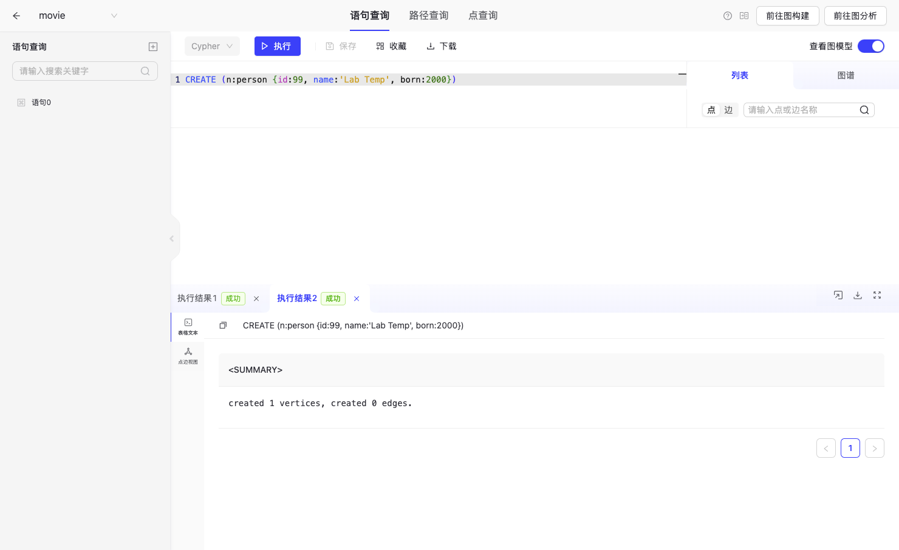
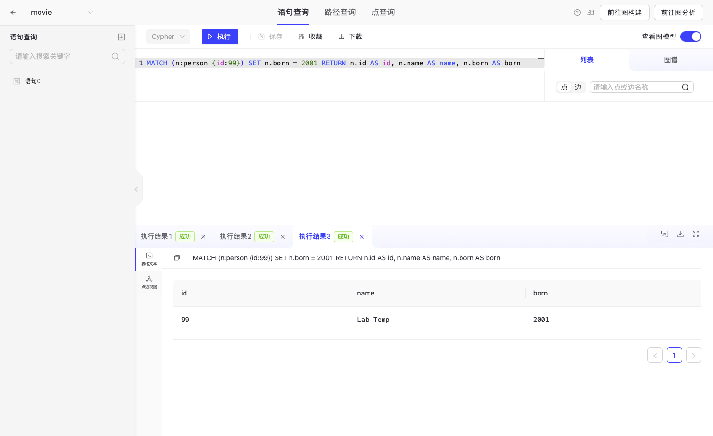
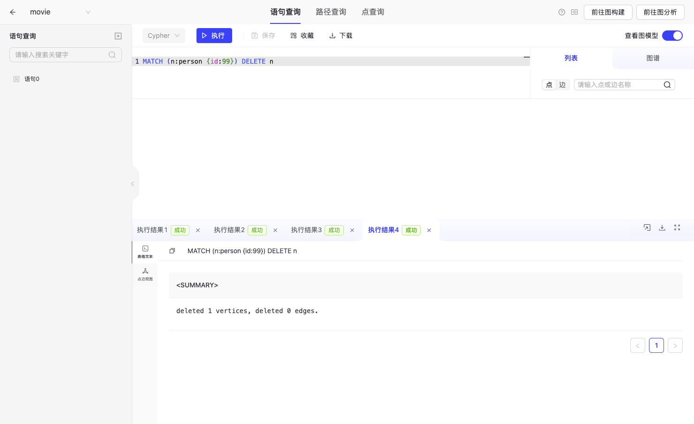
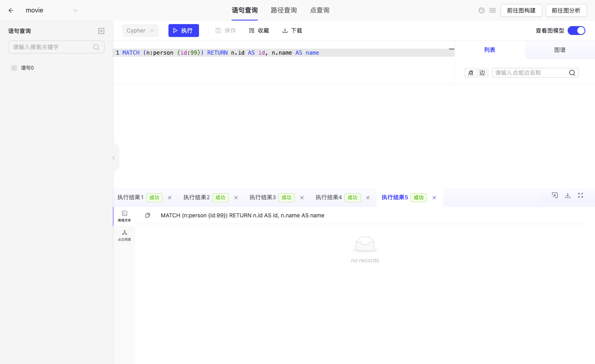
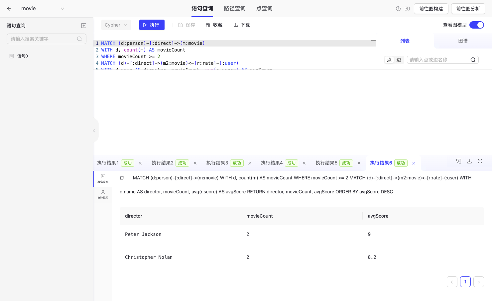

# 专业综合实践 作业1：图数据库 TuGraph

- 姓名：李睿男
- 学号：2023310975
- 学院：中央财经大学 信息学院
- 课程：专业综合实践
- 学期：2026 年秋
- 指导教师：王卯宁

本仓库是作业 1 的实验报告。四项要求对应下面四节：启动平台、建模导入与增删改查、自拟聚合查询、GitHub 提交。

## 1. 安装与启动

课堂讲义在 Windows 上使用 Docker，镜像为 `tugraph/tugraph-runtime-ubuntu18.04:4.5.0`，Web 端口 7070，Bolt 端口 7687。本机是 Apple Silicon 的 macOS，没有现成的 Docker Desktop，因此用 Colima 提供 Docker 运行时，再拉取能够访问到的 TuGraph 4.5 运行镜像。

安装并启动本机 Docker：

```bash
brew install colima docker
colima start --cpu 2 --memory 4 --disk 40 --vm-type vz --vz-rosetta --arch aarch64
```

拉取并启动 TuGraph。课堂命令把数据和日志挂到宿主机，并打开插件，这里保持同样的端口和持久化方式：

```bash
docker pull docker.1ms.run/tugraph/tugraph-runtime-centos7:4.5.2
docker tag docker.1ms.run/tugraph/tugraph-runtime-centos7:4.5.2 tugraph/tugraph-runtime-centos7:4.5.2

mkdir -p tugraph-data tugraph-log
docker run -d --name tugraph_demo --platform linux/amd64 \
  -p 7070:7070 -p 7687:7687 -p 9090:9090 \
  -v "$PWD/tugraph-data:/var/lib/lgraph/data" \
  -v "$PWD/tugraph-log:/var/log/lgraph_log" \
  tugraph/tugraph-runtime-centos7:4.5.2 \
  lgraph_server -d run --enable_plugin true
```

端口用途与讲义一致：

| 端口 | 用途 |
| --- | --- |
| 7070 | Web 管理界面，浏览器访问 `http://127.0.0.1:7070` |
| 7687 | Bolt，供 Python / Java 等客户端执行 Cypher |
| 9090 | RPC，供监控和扩展服务 |

浏览器打开 `http://127.0.0.1:7070`。官方默认用户名是 `admin`，默认密码是 `73@TuGraph`。登录成功后页面提示默认密码有风险。本实验在弹窗里选择跳过，先完成后面的建模和查询。截图做完后已经执行 `docker stop tugraph_demo`，本机不再监听 7070。需要再看界面时，用上面的 `docker run` 重新启动即可。

登录后的界面截图：





## 2. 建模、数据导入与增删改查

TuGraph 使用带标签的属性图。本实验按讲义中的 yago 电影例子建一张子图 `movie`，规模缩小到能手工核对的程度。点表示实体，边表示关系。

| 标签 | 类型 | 属性 | 含义 |
| --- | --- | --- | --- |
| person | 顶点 | id, name, born | 导演、演员或制片人 |
| movie | 顶点 | id, title, tagline | 电影 |
| genre | 顶点 | id, name | 类型 |
| user | 顶点 | id, name | 评分用户 |
| direct | 边，person → movie | 无 | 执导 |
| produce | 边，person → movie | 无 | 制片 |
| acted_in | 边，person → movie | role | 出演 |
| has_genre | 边，movie → genre | 无 | 属于某类型 |
| rate | 边，user → movie | score | 评分 |

主键都是 `id`。TuGraph 必须先建标签，再写入数据，属性也必须先出现在标签定义里。建模语句在 `cypher/01_schema.cypher`，导入语句在 `cypher/02_import.cypher`。`data/` 里是同一批数据的 CSV，对应讲义里「选择 csv、指定标签、映射属性」的导入方式。

图中有 6 个人、8 部电影、5 个类型、3 个用户。Peter Jackson 执导《指环王》两部，Christopher Nolan 执导《盗梦空间》和《奥本海默》，其余导演各执导 1 部。评分集中在这几部电影上，供第 3 节聚合。

导入后查询全部电影，确认数据已经写入：

```cypher
MATCH (m:movie) RETURN m.id AS id, m.title AS title ORDER BY id;
```

增删改查用一个临时顶点，避免改动后面聚合要用的导演和电影。语句在 `cypher/03_crud.cypher`：

1. 创建 `id = 99` 的 person，姓名 Lab Temp，出生年 2000。
2. 按主键查回该点。
3. 把出生年改为 2001。
4. 删除该点。
5. 再查一次，结果应为空。

子图 `movie` 建好以后，控制台显示 4 类点、22 个点、5 类边、27 条边。22 个点是 6 个 person、8 部 movie、5 个 genre、3 个 user。27 条边是 7 条 direct、1 条 produce、1 条 acted_in、8 条 has_genre、10 条 rate。



导入后在语句查询里列出全部电影。控制台返回 8 行，截图里能直接看到前 4 部，其余 4 部是 Inception、Oppenheimer、Barbie、Hero。



增删改查截图：









Bolt 复现方式：

```bash
python3 -m venv .venv
.venv/bin/pip install -r requirements.txt
export TUGRAPH_PASSWORD='修改后的密码'
.venv/bin/python scripts/run_lab.py
```

`scripts/run_lab.py` 按文件顺序执行 Cypher。`createGraph` 在默认图上执行，其余语句连到子图 `movie`。脚本假定子图是空的，重复执行前要先 `CALL dbms.graph.deleteGraph('movie')`。Cypher 字符串里不要写未转义的单引号，电影 Hero 的 tagline 用了 `One man strength`。

## 3. 自拟聚合查询

问题：统计每位导演执导的电影部数，以及这些电影收到的用户评分的平均值。只保留至少执导 2 部电影的导演，按平均分从高到低排列。

先按导演聚合电影部数，再用 `WHERE` 滤掉只执导 1 部的人，然后才把评分边展开求平均。如果先匹配评分再 `count(m)`，一部电影有多条评分时部数会被放大，所以部数和平均分分成两段 `WITH`。

```cypher
MATCH (d:person)-[:direct]->(m:movie)
WITH d, count(m) AS movieCount
WHERE movieCount >= 2
MATCH (d)-[:direct]->(m2:movie)<-[r:rate]-(:user)
WITH d.name AS director, movieCount, avg(r.score) AS avgScore
RETURN director, movieCount, avgScore
ORDER BY avgScore DESC;
```

按导入的评分手算：

- Peter Jackson 执导 2 部。四条评分为 9、8、10、9，平均分为 9。
- Christopher Nolan 执导 2 部。五条评分为 9、8、7、8、9，平均分为 8.2。
- James Wan、Greta Gerwig、Zhang Yimou 都只执导 1 部，被 `WHERE movieCount >= 2` 去掉。

实际返回与手算一致。Web 把 9.0 显示成 9，Bolt 客户端打印 9.0。语句保存在 `cypher/04_aggregation.cypher`，原始行在 `results/aggregation.txt`。




参考资料：

- TuGraph 文档：https://tugraph-db.readthedocs.io/zh-cn/latest/3.quick-start/1.preparation.html
- TuGraph 仓库：https://github.com/TuGraph-family/tugraph-db
